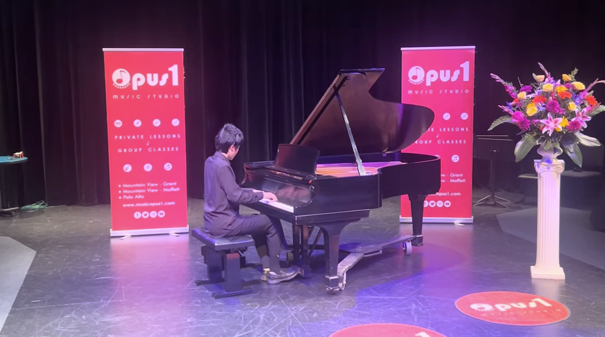
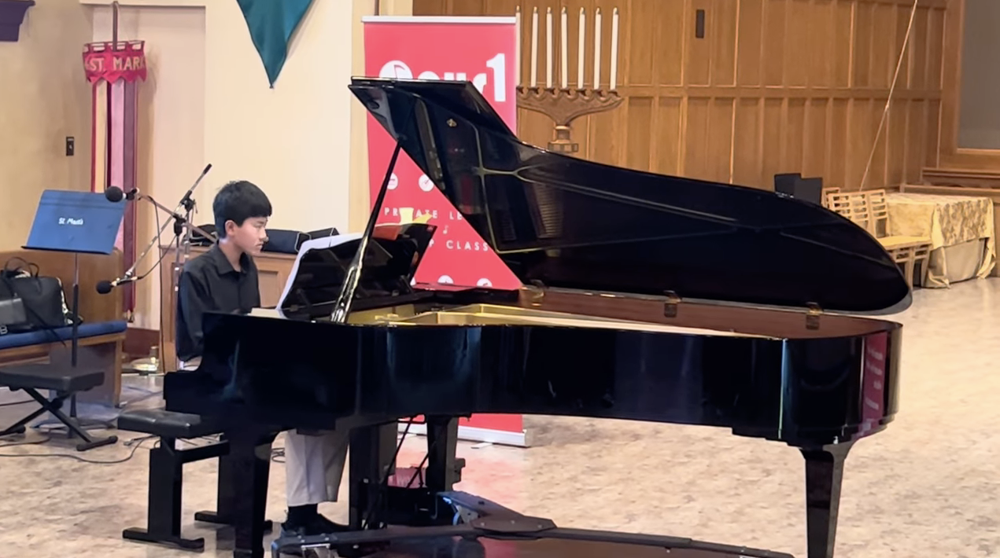
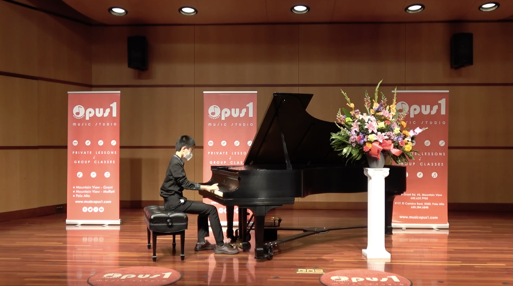
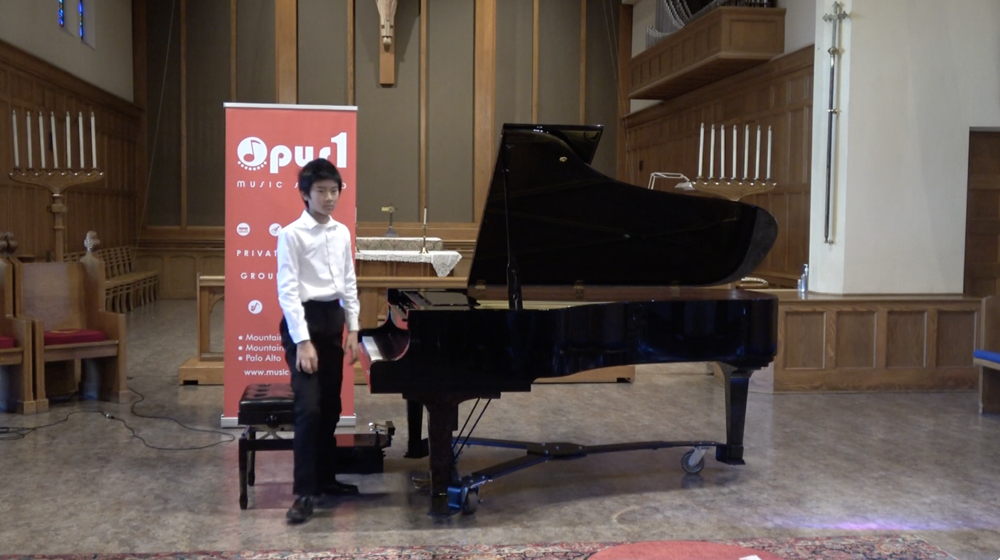

# ART

Welcome to the Art repository site including piano, drawing and digital artwork.

## Piano Recital
Please move mouse over each photo to reveal its title and click to watch the original piano recital.

## Original Profolio
Please hover mouse over each image to display its title and click to view the original drawing.

<table class="center">
    <tr>
    <td></td>
    <td></td>
    <td></td>
    </tr>
    </table>
    <table class="center">
    <tr>
    <td></td>
    <td></td>
    <td></td>
    </tr>
    </table>
    <table class="center">
    <tr>
    <td></td>
    <td></td>
    <td></td>
    </tr>
    </table>
    <table class="center">
    <tr>
    <td></td>
    <td></td>
    <td></td>
    </tr>
</table>

## Digital Artwork
Here demonstrates several digital AI enhancement through my experiments, hang mouse over each picture to show its title and click for a closer view.

<table class="center">
    <tr>
    <td></td>
    <td></td>
    <td></td>
    </tr>
</table>

## Acknowledgements
- [Opus 1 Music Studio](https://musicopus1.com/)
- [Ichen Art Academy](http://www.ichenartacademy.com)

